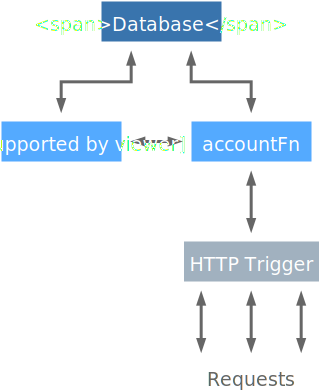

# Bank example

## Summary

This bank example let clients create their own bank account, transfer money between accounts and check account balances. In this example you can see:

1. how a HTTP trigger works with a function
2. how a function interacts with another function
3. how a function works with third-party component (database).

## Example Diagram

1. HTTP trigger proxies requests to function "accountFn" for account operation
2. Function "accountFn" talks to another function "authFn", which is not exposed to external network, to check operation permission.
3. Function "authFn" checks permission with DB records and replies result back to caller function.
4. Function "accountFn" write/update DB records and replies operation result. 
