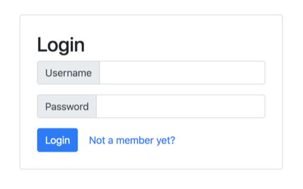
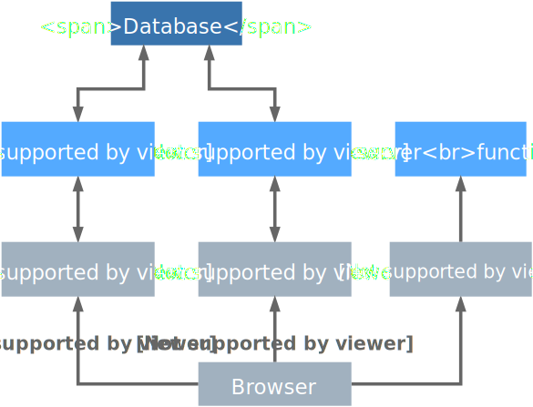

# Fission Bank Sample

This bank example let users create their own bank account, deposit, withdraw, transfer money between accounts and check account balances. In this example you will see:

1. how a HTTP trigger works with a function
2. how a function works with third-party component (database).

# Installation

1. Create database pod

```bash
$ kubectl apply -f cockroachdb.yaml
```

2. Install go dependencies

```bash
$ cd functions/
$ glide install -v
```

3. Use `fission spec` to create application

```bash
$ fission spec apply --wait
```

4. Check application status

After `fission spec apply`, you can see that all functions, http triggers and packages are successfully created.

```bash
$ fission pkg list
NAME        BUILD_STATUS ENV
bank-go-pkg succeeded    go
web-pkg     succeeded    python

$ fission fn list
NAME                 UID                                  ENV    EXECUTORTYPE MINSCALE MAXSCALE MINCPU MAXCPU MINMEMORY MAXMEMORY TARGETCPU
account-create       6d75b1ce-96db-11e8-99ff-080027c3bbd5 go     newdeploy    1        1        0      0      0         0         80
account-get          6d7650bf-96db-11e8-99ff-080027c3bbd5 go     newdeploy    1        1        0      0      0         0         80
account-login        6d859eb9-96db-11e8-99ff-080027c3bbd5 go     newdeploy    1        1        0      0      0         0         80
bank-web             6da3e315-96db-11e8-99ff-080027c3bbd5 python newdeploy    1        1        0      0      0         0         80
options-handler      6dc28a15-96db-11e8-99ff-080027c3bbd5 go     newdeploy    1        1        0      0      0         0         80
transaction-deposit  6de123ba-96db-11e8-99ff-080027c3bbd5 go     newdeploy    1        1        0      0      0         0         80
transaction-get      6dff7085-96db-11e8-99ff-080027c3bbd5 go     newdeploy    1        1        0      0      0         0         80
transaction-transfer 6e1e2804-96db-11e8-99ff-080027c3bbd5 go     newdeploy    1        1        0      0      0         0         80
transaction-withdraw 6e3cae13-96db-11e8-99ff-080027c3bbd5 go     newdeploy    1        1        0      0      0         0         80


$ fission route list
NAME                                 METHOD  HOST URL                           INGRESS FUNCTION_NAME
3c02fd61-a7b8-4613-bff3-98ed27a53faf POST         /transaction/transfer         false   transaction-transfer
3f74a3a1-edc5-470d-bbcd-4395377705a1 OPTIONS      /transaction                  false   options-handler
4452f18c-f9b2-40d6-b676-ee868627e237 OPTIONS      /sessions                     false   options-handler
4faa1724-f17c-4d33-9e55-3b44c7625e63 POST         /accounts                     false   account-create
6b2be34d-5f07-4426-8baf-951c71db3602 OPTIONS      /transaction/transfer         false   options-handler
6fac456d-d155-422c-8580-c464ba308050 OPTIONS      /accounts/                    false   options-handler
80153f84-023d-4158-914d-5d6affb9fbca GET          /accounts/                    false   account-get
93845c23-eadb-4335-9a1c-1ddec0da19bd OPTIONS      /transaction/withdraw         false   options-handler
995946d7-91e3-4809-85c6-b8405e68dd74 GET          /accounts                     false   account-get
9d099a77-b834-4c9d-87c4-10c3475f6f3a POST         /sessions                     false   account-login
afc56bc2-00b8-408f-9fd5-78af7bb6c9aa GET          /bank/{html:[a-zA-Z0-9\.\/]+} false   bank-web
b2b2b163-3d92-4bfb-a23e-50c36d84da73 POST         /transaction/deposit          false   transaction-deposit
b9e13516-4d65-4597-bbb9-927bebe4bdca GET          /transaction/                 false   transaction-get
ba9c8cdb-ad31-4eec-9ae9-00001fdd85e6 OPTIONS      /transaction/deposit          false   options-handler
d089b784-c35c-4b20-a30d-b708aa7f827c POST         /accounts/                    false   account-create
d090606a-3b9d-4550-b46a-d65b7f437d65 POST         /transaction/withdraw         false   transaction-withdraw
e019d4be-fdfe-404a-bfca-5a5b24fe531f OPTIONS      /accounts                     false   options-handler
f4ac1efb-179f-4cca-8229-7594d513fc92 GET          /transaction                  false   transaction-get

$ kubectl -n bank get pod
NAME                           READY     STATUS    RESTARTS   AGE
cockroachdb-66cc5bfd9c-p2w8d   1/1       Running   0          3h

$ kubectl -n bank get svc
NAME          TYPE        CLUSTER-IP      EXTERNAL-IP   PORT(S)              AGE
cockroachdb   ClusterIP   10.106.44.165   <none>        26257/TCP,8080/TCP   3h

```

5. Visit application website

You shall see a login dialog on browser if everything works well.

```bash
http://$(FISSION_ROUTER)/bank/login.html
```



## Application Diagram



1. When user visits web page with url above, the browser hits web-server http trigger to get web html files.
2. Any operations on web page send an AJAX http requests to backend RESTful APIs function.
3. Once a function receive requests it interacts with database, which launched in different namespace, to get/insert/update records.
4. After database operations, the function response user requests with http code & message body.
